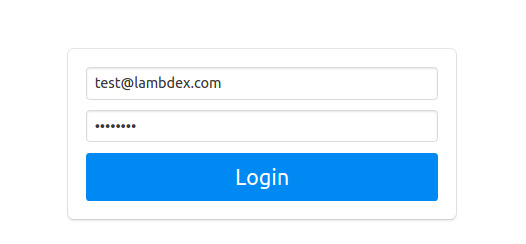
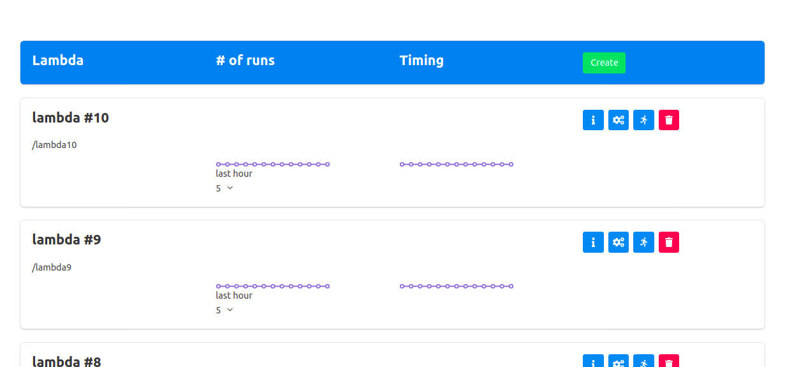
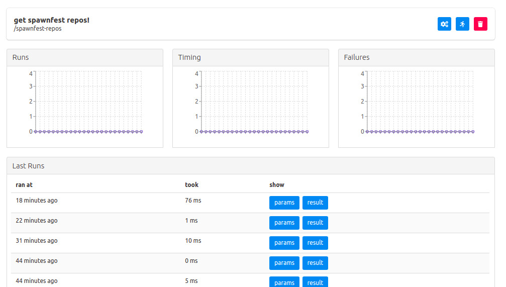

# Lambdex

## Goal

Lambdex is a code execution service, allowing one to run code without building the surrounding infrastructure.
Just upload the code and trigger its execution, kind of like a DIY AWS Lambda.

It includes a web UI through which users can create lambdas by uploading code as anonymous functions, which will be compiled by the server.
Once the lamdba is created its execution can be triggered by POSTing to an endpoint, or manually by the user, and then its execution metrics and statistics viewed.

## Setting up

To build and run Lambdex you must have Elixir 1.6 or higher, a running instance of PostgreSQL, and NodeJS:

You can set up your own Postgres installation or run one using the provided `docker-compose.yml` with `docker-compose up`.
If you use your own Postgres installation you must edit the `apps/lambdex_server/config/dev.exs` file so that the section including 

```elixir
# Configure your database
config :lambdex_server, LambdexServer.Repo,
  username: "postgres",
  password: "postgres",
  database: "lambdex",
  hostname: "localhost",
  pool_size: 10
```

contains the proper values. 

Since Lambdex is built using Phoenix, you can use the standard steps: 
  * Install dependencies with `mix deps.get`
  * Create and migrate your database with `mix ecto.setup`
  * Install Node.js dependencies with `cd assets && npm install`
  * Start Phoenix endpoint with `mix phx.server`
  * Open a browser and point it to `localhost:4000`

## Using

### Logging in



The database seed includes a created user 'test@lambdex.com' with password 'password' which you can use to log in and start using the system.

On login the user is presented with a list of runnable lambdas and their details.



### Creating lambdas

<!--  -->

To create a new lambda, click on the green button labeled `Create`.

A screen with a few input fields and a text area will be presented
The field labelled `Name` is a human-readable string to identify the lambda.

`Path` is the url path parameter which will identify this lambda. For example, if we create a lambda with path `test`, it will trigger on a POST to `http://localhost:4000/lambdas/test/`.

`ENV Params` is a json object which will be passed to the lambda on each execution. The environment parameters will not vary from execution to execution.

`Code` is the text area in which the lambda code goes.
The lambda function must have arity two, e.g.

```elixir
fn (environment_params, execution_params) ->
    ... your code here ...
end
```

As mentioned the environment params are set on lambda creation, while the execution params are provided on each execution trigger.

The `Enabled` checkbox must be set to enable the lambda to run.

Note that since lambdas are just anonymous functions which will run in the context of the Lambdex server, the only dependencies you can use are those provided by the server. For that purpose the Lambdex server includes a series of popular dependencies which can be used from the user provided lambdas:
- [absinthe](https://hex.pm/packages/absinthe)
- [base64url](https://hex.pm/packages/base64url)
- [bbmustache](https://hex.pm/packages/bbmustache)
- [bcrypt_elixir](https://hex.pm/packages/bcrypt_elixir)
- [calendar](https://hex.pm/packages/calendar)
- [comeonin](https://hex.pm/packages/comeonin)
- [csv](https://hex.pm/packages/csv)
- [decimal](https://hex.pm/packages/decimal)
- [earmark](https://hex.pm/packages/earmark)
- [ex_aws](https://hex.pm/packages/ex_aws)
- [exjsx](https://hex.pm/packages/exjsx)
- [floki](https://hex.pm/packages/floki)
- [gpb](https://hex.pm/packages/gpb)
- [hackney](https://hex.pm/packages/hackney)
- [httpoison](https://hex.pm/packages/httpoison)
- [httpotion](https://hex.pm/packages/httpotion)
- [inflex](https://hex.pm/packages/inflex)
- [jason](https://hex.pm/packages/jason)
- [neotoma](https://hex.pm/packages/neotoma)
- [poison](https://hex.pm/packages/poison)
- [redix](https://hex.pm/packages/redix)
- [sweet_xml](https://hex.pm/packages/sweet_xml)
- [uuid](https://hex.pm/packages/uuid)
- [yamerl](https://hex.pm/packages/yamerl)

### Running Lambdas

Once a lambda has been created it will be listed in the main screen.
Each entry has four buttons: `Info`, `Edit`, `Run`, `Delete`.

<!--  -->

Clicking on the `Info` button will show the details for that lambda.



Clicking on the `Run` button will run the lambda manually.

## Next steps

- Improve lambda debuggability.
- Make the LambdexCore API support asyncronous running of lambdas. 
- Limit lambda execution time to a configured value.
- Validate the uploaded code to better ensure it runnability and prevent use of problematic features such as spawn, ETS tables, etc.
- Provide more features for the executing lambdas, such as
  - access to datastores and key-value stores
  - sending emails
- Monitoring features such as CPU and memory usage.
- Provide a scheduler (allowing to periodically trigger lambda execution).
- Allow full modules to be uploaded in addition to simple anonymous functions.
- Capture logs and output.
- Allow execution of lambdas on other nodes to allow horizontal scaling.
- Accept functions written in Erlang.
- Allow for more complicated and usefull execution triggering logic, e.g. read from AWS SQS or RabbitMQ queues, receive Google alerts, IFTTT-style trigger rules, automatic 3rd party HTTP API polling.
- Soft real-time update of UI via channels to reflect a lamnbda's execution statistics.

## Final worlds
Lambda! Lambda! Lambda! Lambda! Lambda! Lambda! Lambdaaaa!
